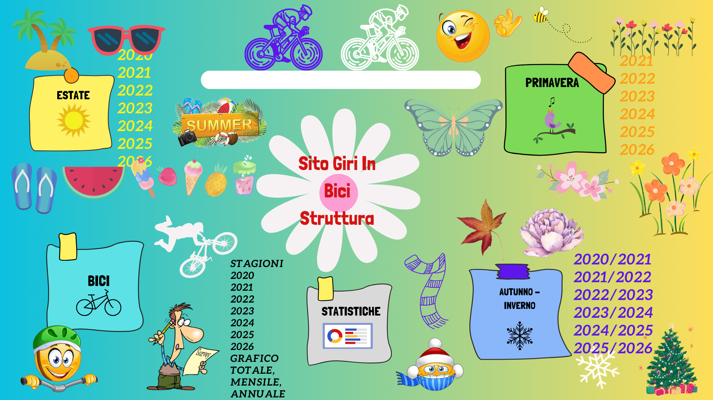

# 📋 Aggiornamenti e Manutenzione

Questa guida descrive come aggiornare i file e creare nuove stagioni e anni per mantenere il sito sempre aggiornato. È pensata per essere semplice e comprensibile, anche per chi non ha esperienza di programmazione.

---

## 📂 Aggiornare i Dati JSON

### Stagione

1. **Aggiorna il file JSON per la stagione Autunno Inverno 2024-2025**
   - **Percorso:** [`Autunno_Inverno/Periodi/Json/2024-2025.json`](Autunno_Inverno/Periodi/Json/2024-2025.json)
   - Aggiungi i dettagli delle corse seguendo lo stesso schema delle altre stagioni.

### Statistiche

1. **Aggiorna le statistiche per il 2025**
   - **Percorso:** [`Statistiche/Js/anni/2025.json`](Statistiche/Js/anni/2025.json)
   - Modifica i chilometri (km) di Gennaio e aggiorna il numero totale di corse dell'anno.

---

## 🗓 Inizio di una Nuova Stagione

### Creazione della Nuova Stagione

#### Struttura HTML

Crea i file HTML e JSON per la stagione nelle cartelle di riferimento, seguendo i percorsi indicati, e inserendo l’anno della stagione:

- **Primavera** 🌸: [`Primavera/Periodi/`](Primavera/Periodi/)
- **Estate** 🌞: [`Estate/Periodi/`](Estate/Periodi/)
- **Autunno Inverno** 🍁❄️: [`Autunno_Inverno/Periodi/`](Autunno_Inverno/Periodi/)

#### File JSON per la Nuova Stagione

Crea un file JSON per ogni nuova stagione all’interno delle cartelle di riferimento con il nome dell’anno:

- **Primavera** 🌸: [`Primavera/Periodi/Json`](Primavera/Periodi/Json)
- **Estate** 🌞: [`Estate/Periodi/Json`](Estate/Periodi/Json)
- **Autunno Inverno** 🍁❄️: [`Autunno_Inverno/Periodi/Json`](Autunno_Inverno/Periodi/Json)

#### Aggiornamento del File Principale della Stagione 🌸🌞🍁❄️

Aggiorna il file principale del nuovo periodo nella stagione in cui hai creato la nuova sottostagione, specificando il percorso e il colore del nuovo periodo come fatto per gli altri:

- **Primavera** 🌸: [`Primavera/primavera.json`](Primavera/primavera.json)
- **Estate** 🌞: [`Estate/estate.json`](Estate/estate.json)
- **Autunno Inverno** 🍁❄️: [`Autunno_Inverno/autunno-inverno.json`](Autunno_Inverno/autunno-inverno.json)
- **Stagione Generale** 🌸🌞🍁❄️: [`Statistiche/Js/anni/stagioni.json`](Statistiche/Js/anni/stagioni.json)  
  Aggiungi il percorso del nuovo anno nella stagione interessata all’interno dei vari sottoperiodi.

---

## 📅 Creazione di un Nuovo Anno

### Passaggi da Seguire

1. **Creare la Struttura HTML**
   - Crea un nuovo file HTML per il nuovo anno nella cartella: [`Statistiche/Anni/`](Statistiche/Anni/) con il nome del nuovo anno.

2. **Creare il File JSON**
   - Crea un nuovo file JSON per l’anno nella cartella: [`Statistiche/Js/anni/`](Statistiche/Js/anni/) con il nome del nuovo anno.

3. **Aggiornare le Immagini**
   - Aggiungi un’immagine per il nuovo anno nella cartella: [`Statistiche/Anni/Img/`](Statistiche/Anni/Img/) con il nome del nuovo anno.

4. **Aggiornare i File di Storia Generale**
   - **Generale:** Modifica [`Statistiche/Js/History/JSON/Generale.json`](Statistiche/Js/History/JSON/Generale.json), aggiungendo il percorso e il colore del nuovo anno.
   - **Grafico Totale:** Modifica [`Statistiche/Js/History/JSON/GraficoTotale.json`](Statistiche/Js/History/JSON/GraficoTotale.json), aggiungendo il percorso corretto del nuovo anno.
   - **Storico Mensile:** Aggiungi un nuovo record con i dati del nuovo anno in [`Statistiche/Js/History/JSON/StoricoMensile.json`](Statistiche/Js/History/JSON/StoricoMensile.json), specificando il percorso corretto.

---

## 🔐 Credenziali

1. **Nome Utente**
   - **Percorso:** [`Login/users.json`](Login/users.json)

2. **Password Giornaliera**
   - Formato della password: `Giri DD/MM/YYYY`
   - `DD` è il giorno, `MM` il mese e `YYYY` l’anno.
   - I numeri di giorno e mese devono essere preceduti da uno zero se minori di 10 (es. 09 per il 9).

---

## 🌐 Logo e Apertura del Sito

- Link al sito: [Vai al sito](https://giri-in-bici.netlify.app/)

---

## 🗺 Mappa del Sito

---

## 👥 Avatar dei Partecipanti

- [Avatar NM](https://www.komoot.com/it-it/user/1372754001803)  

  

- [Avatar JR](https://www.komoot.com/it-it/user/1381372752571)  

  

---

## 💻 Linguaggi Utilizzati

  
  
  

--- 
