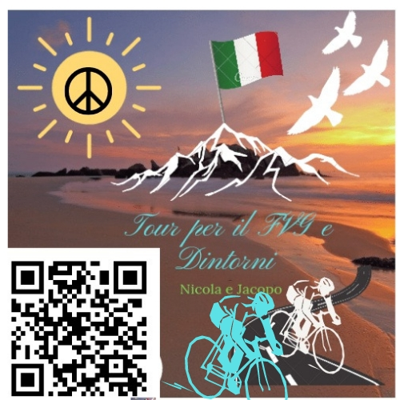
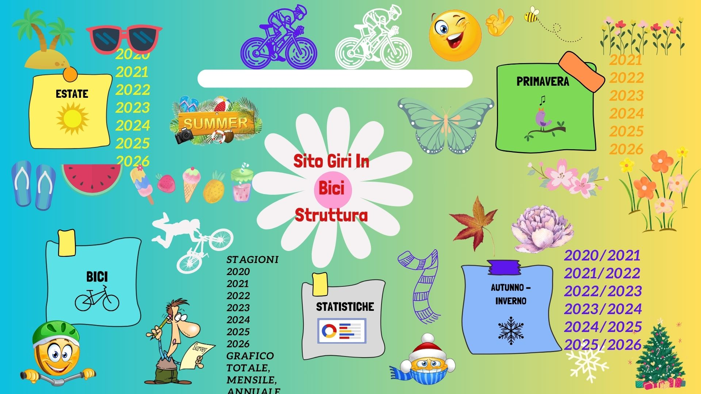

# 📋 Aggiornamenti e Manutenzione

Questa guida descrive come aggiornare i file e creare nuove stagioni e anni per mantenere il sito sempre aggiornato.

---

## 📂 Aggiornare i Dati JSON

### Stagione

1. **Aggiorna il file JSON per la stagione Estate 2026**
   - **Percorso:** [`Estate/Periodi/Json/2026.json`](Estate/Periodi/Json/2026.json)
   - Aggiungi i dettagli delle corse seguendo lo stesso schema delle altre corse.

### Statistiche

1. **Aggiorna il file JSON per le statistiche per il 2026**
   - **Percorso:** [`Statistiche/Js/anni/2026.json`](Statistiche/Js/anni/2026.json)
   - Modifica i chilometri (km) di Luglio e aggiorna e il numero totale di corse dell'anno.

---

## 🗓 Inizio di una Nuova Stagione

### Creazione della Nuova Stagione

### Passaggi da Seguire

1. **Struttura HTML**

   Crea il file HTML per la stagione nelle cartelle di riferimento, seguendo il percorso indicato, e inserendo l’anno della stagione:
   - **Primavera** 🌸: [`Primavera/Periodi/`](Primavera/Periodi/)
   - **Estate** 🌞: [`Estate/Periodi/`](Estate/Periodi/)
   - **Autunno Inverno** 🍁❄️: [`Autunno_Inverno/Periodi/`](Autunno_Inverno/Periodi/)

2. **File JSON per la Nuova Stagione**

   Crea un file JSON per la nuova stagione all’interno delle cartella di riferimento con il nome dell’anno:
   - **Primavera** 🌸: [`Primavera/Periodi/Json`](Primavera/Periodi/Json)
   - **Estate** 🌞: [`Estate/Periodi/Json`](Estate/Periodi/Json)
   - **Autunno Inverno** 🍁❄️: [`Autunno_Inverno/Periodi/Json`](Autunno_Inverno/Periodi/Json)

3. **Aggiornamento del File Principale della Stagione 🌸🌞🍁❄️**

   Aggiorna il file principale del nuovo periodo nella stagione in cui hai creato la nuova sottostagione, specificando il percorso del file con il nome e il colore del nuovo periodo come fatto per gli altri:
   - **Primavera** 🌸: [`Primavera/primavera.json`](Primavera/primavera.json)
   - **Estate** 🌞: [`Estate/estate.json`](Estate/estate.json)
   - **Autunno Inverno** 🍁❄️: [`Autunno_Inverno/autunno-inverno.json`](Autunno_Inverno/autunno-inverno.json)

4. **Sistemazione file Stagioni.json**
   - **Stagione Generale** 🌸🌞🍁❄️: [`Statistiche/Js/anni/stagioni/stagioni.json`](Statistiche/Js/anni/Stagioni/stagioni.json)  
     Aggiungi il percorso del nuovo anno nella stagione interessata all’interno dei vari sottoperiodi.

---

## 📅 Creazione di un Nuovo Anno

### Passaggi da Seguire

1. **Creare la Struttura HTML**
   - Crea un nuovo file HTML per il nuovo anno nella cartella: [`Statistiche/Anni/`](Statistiche/Anni/) con il nome del nuovo anno.

2. **Creare il File JSON**
   - Crea un nuovo file JSON per l’anno nella cartella: [`Statistiche/Js/anni/`](Statistiche/Js/anni/) con il nome del nuovo anno.

3. **Aggiornare le Immagini**
   - Aggiungi un’immagine per il nuovo anno nella cartella: [`Statistiche/Anni/Img/`](Statistiche/Anni/Img/) con il nome del nuovo anno.

4. **Aggiornare i File di Storia Generale**
   - **Generale:** Modifica [`Statistiche/Js/History/JSON/Generale.json`](Statistiche/Js/History/JSON/Generale.json), aggiungendo il percorso e il colore del nuovo anno.
   - **Grafico Totale:** Modifica [`Statistiche/Js/History/JSON/GraficoTotale.json`](Statistiche/Js/History/JSON/GraficoTotale.json), aggiungendo il percorso corretto del nuovo anno e il colore.
   - **Storico Mensile:** Aggiungi un nuovo record con i dati del nuovo anno in [`Statistiche/Js/History/JSON/StoricoMensile.json`](Statistiche/Js/History/JSON/StoricoMensile.json), specificando il percorso corretto e il colore.

---

## 🔐 Credenziali

1. **Nome Utente**
   - **Percorso:** [`About_US/JS/Users.json`](About_US/JS/Users.json)

2. **Password Giornaliera**
   - Formato della password: `Giri DD/MM/YYYY`
   - `DD` è il giorno, `MM` il mese e `YYYY` l’anno.
   - I numeri di giorno e mese devono essere preceduti da uno zero se minori di 10 (es. 09 per il 9).

---

## 🌐 Logo e Apertura del Sito



- Link al sito: [Vai al sito](https://giri-in-bici.netlify.app/)

---

## 🗺 Mappa del Sito



---

## 👥 Avatar dei Partecipanti

- [Avatar NM](https://www.komoot.com/it-it/user/1372754001803)

  

- [Avatar JR](https://www.komoot.com/it-it/user/1381372752571)

  

---

## 💻 Tecnologie Utilizzate

Il sito è stato sviluppato utilizzando le seguenti tecnologie:

<p align="left">
  <a href="https://developer.mozilla.org/en-US/docs/Glossary/HTML5" target="_blank" rel="noreferrer">
    
  </a>
  <a href="https://developer.mozilla.org/en-US/docs/Web/CSS" target="_blank" rel="noreferrer">
    
  </a>
  <a href="https://developer.mozilla.org/en-US/docs/Web/JavaScript" target="_blank" rel="noreferrer">
    
  </a>
</p>

---

---

## 🎨 Struttura grafica (aggiornata)

Tutto l'aspetto del sito nasce da un unico foglio di stile condiviso.

### Dove si trova cosa

| File                                                                         | A cosa serve                                                                                      |
| ---------------------------------------------------------------------------- | ------------------------------------------------------------------------------------------------- |
| [`assets/css/core.css`](assets/css/core.css)                                 | Design system completo: variabili, tipografia, barra, card, tabelle, grafici, menu, piè di pagina |
| [`assets/js/ui.js`](assets/js/ui.js)                                         | Anno nel piè di pagina, comparsa dei blocchi allo scroll, tasto Esc, voce attiva nella barra      |
| [`assets/js/motion.js`](assets/js/motion.js)                                 | Numeri che salgono da zero, entrata scaglionata delle card, barra di lettura, pulsante torna su   |
| [`giri.css`](giri.css)                                                       | Tema della home, delle bici, del QR code e del confronto stagioni                                 |
| [`Primavera/Primavera.css`](Primavera/Primavera.css)                         | Solo i colori della primavera                                                                     |
| [`Estate/Estate.css`](Estate/Estate.css)                                     | Solo i colori dell'estate                                                                         |
| [`Autunno_Inverno/Autunno_Inverno.css`](Autunno_Inverno/Autunno_Inverno.css) | Solo i colori di autunno e inverno                                                                |
| [`Statistiche/Style_statistiche.css`](Statistiche/Style_statistiche.css)     | Solo i colori delle statistiche                                                                   |
| [`Login/StyleLogin.css`](Login/StyleLogin.css)                               | Pagina di accesso                                                                                 |
| [`About_US/StyleAbout.css`](About_US/StyleAbout.css)                         | Pagina informazioni                                                                               |

Ogni tema importa `core.css` e ridefinisce **tre sole variabili**:

```css
@import url("../assets/css/core.css");

:root {
  --a1: #0ca678; /* colore principale */
  --a2: #63c65f; /* colore secondario del gradiente */
  --a-soft: rgba(12, 166, 120, 0.13); /* versione trasparente per gli sfondi */
}
```

Per cambiare il colore di una stagione basta modificare quelle tre righe: titoli,
bordi delle card, pulsanti, intestazioni delle tabelle e paginazione si aggiornano
da soli.

### Schema di ogni pagina

```html
<header class="site-bar">   <!-- logo + navigazione a icone -->
<main class="wrap stack">
  <section class="hero">    <!-- occhiello, titolo, sottotitolo -->
  <section class="section"> <!-- contenuto -->
</main>
<footer class="site-foot">  <!-- copyright + collegamenti -->
```

### Classi utili

- `.wrap` larghezza massima centrata &middot; `.stack` spaziatura verticale
- `.eyebrow` etichetta piccola sopra il titolo
- `.table-wrap` avvolge una tabella e la rende scorrevole sul telefono
- `.grafico` cornice bianca attorno a un grafico
- `.gallery` + `.shot` griglia di foto scaricabili
- `.reveal` il blocco compare con una dissolvenza al primo scroll

### Cosa non è cambiato

I nomi delle classi generate da JavaScript (`.colore`, `.misuracolore`, `.container`,
`.Primaveracontorno`, `.Statistiche`, `.titoli`, `#pagination`, `#stampa`, `#totale`,
`#km`, `#mesi`) sono rimasti identici: gli script funzionano senza modifiche.

### Note tecniche

- Tema chiaro e scuro automatici (`prefers-color-scheme`)
- Animazioni disattivate per chi imposta `prefers-reduced-motion`
- Tutte le pagine hanno `charset`, `viewport`, `lang="it"`, descrizione e anteprima social

---

## ✨ Animazioni

Tutte le animazioni stanno nella sezione 22 di
[`assets/css/core.css`](assets/css/core.css) e in
[`assets/js/motion.js`](assets/js/motion.js). Nessuna libreria esterna.

| Effetto              | Dove si vede                                                                            |
| -------------------- | --------------------------------------------------------------------------------------- |
| Apertura in sequenza | La barra scende, poi occhiello, titolo, sottotitolo e immagine entrano uno dopo l'altro |
| Titoli che respirano | I titoli in gradiente scorrono lentamente avanti e indietro                             |
| Comparsa allo scroll | Ogni sezione con classe `.reveal` sale in dissolvenza quando entra nello schermo        |
| Entrata scaglionata  | Le card dei periodi, delle statistiche, delle bici e le foto compaiono a cascata        |
| Numeri che salgono   | I chilometri e i totali contano da zero quando la card entra nello schermo              |
| Segnaposto luminoso  | Mentre i JSON si caricano, i riquadri mostrano un'onda di luce                          |
| Barra di lettura     | Sottile linea in alto che segue lo scorrimento della pagina                             |
| Torna su             | Pulsante in basso a destra che compare dopo 600 px di scroll                            |
| Micro-interazioni    | Icone che saltano, card che si sollevano, foto che zoomano, righe che scorrono          |

### Aggiungere l'animazione a una sezione nuova

```html
<section class="section reveal">
  <p class="eyebrow">Etichetta</p>
  <h2>Titolo</h2>
  ...
</section>
```

> ⚠️ Metti sempre almeno un titolo dentro la sezione: se il blocco è vuoto e alto
> zero pixel, il rilevatore dello scroll non può accorgersene. In ogni caso dopo
> 3 secondi tutto viene mostrato comunque, come rete di sicurezza.

### Disattivare tutto

Chi ha attivato "riduci movimento" nelle impostazioni del sistema vede il sito
completamente statico: conteggi, dissolvenze e barra di lettura si spengono da soli.

---

## 🖼 Immagini e logo delle stagioni

### Le foto si vedono intere

Nessuna immagine viene ritagliata: `object-fit: contain`, altezza automatica e
nessuno zoom al passaggio del mouse. La galleria dei periodi usa colonne da
170–220 px, così le foto restano piccole e ordinate.

| Elemento                                        | Larghezza massima |
| ----------------------------------------------- | ----------------- |
| Foto dei periodi (`.shot`)                      | 220 px            |
| Copertina della stagione (`.immagini_stagione`) | 340 px            |
| Logo della home (`.hero-logo`)                  | 280 px            |
| Foto squadra (`.immmaginejnrobot`)              | 260 px            |
| Foto delle bici (`.immagine_bicisx`)            | 340 px            |

Per cambiare la dimensione delle foto basta la riga `grid-template-columns`
di `.gallery` nella sezione 13 di [`assets/css/core.css`](assets/css/core.css).

### Il logo delle stagioni

Prima veniva caricato da Pinterest (`i.pinimg.com`), che blocca il collegamento
diretto: sul sito appariva un'immagine rotta. Ora è un file locale disegnato su
misura, [`assets/img/stagioni.svg`](assets/img/stagioni.svg): una ciambella divisa
nei tre colori delle stagioni con una bicicletta al centro.

Si trova in due posti:

- **pulsante nella barra** in alto (con etichetta "Stagioni", che sparisce sotto i 780 px)
- **logo grande** nell'intestazione di [`Statistiche/stagioni.html`](Statistiche/stagioni.html)

Essendo un SVG resta nitido a ogni dimensione e funziona anche senza connessione.
