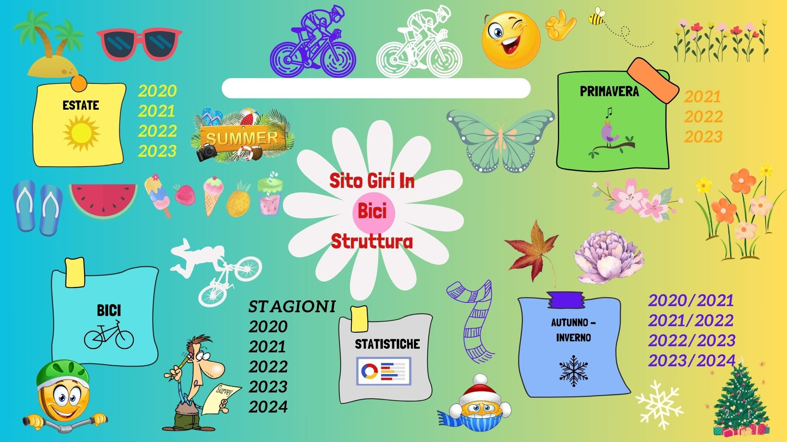

<h1>ogni volta aggiornare </h1>
 

 Aggiornare js stagione corrispondente, statistiche anno interessato e statistiche generale, hamburger con vari km e corse

 
 

periodo interessato -> periodoanno.html
 

 
<h1> Credenziali </h1>

Nome Utente -> NicoMaker

Password -> Giri2023

 
<h1>MAPPA SITO </h1>

