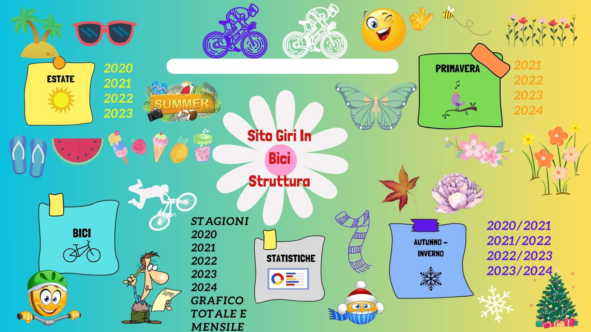

# Ogni volta aggiornare

## Aggiornare HTML

- Giri con vari km e corse -> Giri.html

## Aggiornare JS

- js corrispondente alla stagione e al periodo (Autunno - Inverno, Primavera o Estate dell'anno interessato) -> 2024.js in Pimavera (aggiunta corsa)
- Stagione corrispondente (Autunno-Inverno, Primavera o Estate) Estate.js o Autunno-inverno.js o Primavera.js -> Primavera.js (aggiorni km)
- Statistiche anno interessato (km per mese e numero corse) -> 2024.js (aggiorni km per mese)
- Statistiche generale (km anno e numero corse) -> generaleStatistiche.js (aggiorni km anno)
- stagioni.js (mettere a posto somma dei km per stagione Autunno-Inverno, Primavera o Estate) -> Primavera (aggiorni km per stagione)

- Ricordarsi ogni mese di sistemare i mesi totali -> generaleStatistiche.js

## Credenziali

- Nome Utente -> NicoMaker
- Password -> Giri anno corrispondente

## Logo e Apertura sito

[Apertura sito principale](https://giri-in-bici.netlify.app/)

## Mappa Sito

## Avatar Partecipanti

